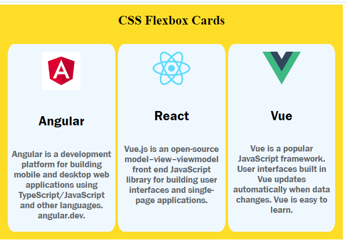

## Here is a screenshot of CSS Flexbox Cards

### Project Overview
- **HTML**: Structured content using semantic `
` elements.
- **CSS**: Utilized Flexbox for card layout and styling.
- **Cards**: Displayed with rounded corners and centered content.
- **Responsive**: Grid layout adapts to different screen sizes.

### Key Features
- Responsive card layout using Flexbox.
- Consistent styling for cards and content.
- Clear and concise presentation of technology details.
